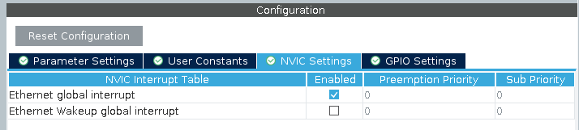

# Zenoh-Pico & LWIP with STM32H5 Step By Step Tutorial

## Overview

This file is a detailed step-by-step tutorial on how to integrate **Zenoh-Pico** and **LWIP** with an **STM32H563ZI Nucleo board**. It covers all steps from the CubeMX project creation and peripherals setup, modification on CMakeLists.txt, to include required libraries, a basic pub/sub example and how to use **GitHub Actions** for automating builds and firmware releases.
This tutorial assumes that you have some basic knowledge of STM32CubeMX, CMake, and GitHub Actions. And that you are using a NUCLUEO-H563ZI board, if you are using a different board, you may need to adjust some aspects as pinout and clock configuration based on the board's datasheet.

## Project Setup

### CubeMX Project Creation

Open STM32CubeMX and on the top bar, uses File -> New Project.


When prompted about TrustZone, select the option "withoud TrustZone activated".

First step, go to Project Manager and uses the **browse** button to select the location of the project, and the project name to give a name to the project. Make sure also to change the **Toolcahin / IDE** to CMake.


One extra step, this is optional, but I recommend since it keeps the code more organized. Go to the Project Manager -> Code Generator and set the **Generate peripheral initialization as a pair of '.c/.h' files per peripheral**. This will make CubeMX split the peripheral initialization code into a .c and .h file, making it easier to modularize the code.
Also recommended to change to **Copy only the necessary library files** to avoid copying unnecessary files.


### Clock Configuration

This step is specific to the NUCLEO-H563ZI board. If you are using a different board, you may need to adjust the clock configuration based on the board's datasheet.

Go to the Pinout & Configuration -> System Core -> RCC

1. HSE set to BYPASS Clock Source
2. LSE set to Crystal/Ceramic Resonator


After this step go to the Clock Configuration and make the following changes:

1. Click on teh Input Frequency (HSE) and set it to 8MHz, just click on the field and type the value 8.
2. Set the PLL1 Source to HSE
3. Set System Clock Mux to PLLCLK


After these steps you should have some errors on the clock sector, just go to the HCLK (MHz) and set it to 250MHz, and click enter. You should see a message stating that the configuration is being updated, after some seconds the errors should disappear and your configuration should be like this:


### Configure the ICACHE

On the Pinout & Configuration -> System Core -> ICACHE, enable the ICACHE to 1 way direct mapped.


### Configure USART3

On the NUCLEO-H563ZI board, the USART3 is connected to the ST-Link, so we can use it to print debug messages. Go to the Pinout & Configuration -> Connectivity -> USART3 and enable the USART3 setting it to asynchronous mode. All configurations are default.


After that we need to fix the USART3 pinout, RX to PD9 and TX to PD8.


### Configure the Ethernet

On the NUCLEO-H563ZI board, the Ethernet is connected to the RMII interface, so we need to configure it. Go to the Pinout & Configuration -> Connectivity -> ETH and enable the ETH setting it to RMII mode. YOu can play with the configuration after having the base project working, but for now just set the TX Descriptor length to 12 and RX Descriptor length to 8. MAC address you can change or leave the default.


Make sure also to enable the Ethernet Global Interrupt on the NVIC settings.



After this also make sure to change the Code generator to not automatically generate the ETH init function call since it will be called on the LWIP ethernetif.c file. Go to Project Manager -> Advanced Settings -> Do note Generate Function Call -> MX_ETH_Init


On the pinout side make sure the following configurations are set:

EHT_TXD0 to PG13
THE_TX_EN to PG11

ETH_MDC to PC1
ETH_REF_CLK to PA1
ETH_MDIO to PA2

ETH_CRS_DV to PA7
ETH_RXD0 to PC4
ETH_RXD1 to PC5

ETH_TXD1 to PB15

For images, check the final pinout after the next section.

### Configuring user button and leds

For the user button:
- Set PC13 to GPIO_EXTI13, add a user label USER_BUTTON

For the user leds:
- Set PF4 to GPIO_Output, add a user label LED_YELLOW
- Set PB0 to GPIO_Output, add a user label LED_GREEN
- Set PG4 to GPIO_Output, add a user label LED_RED

### Final Pinout Configuration

After all these steps, your pinout configuration should look like this:


### FreeRTOS

Even though LWIP can run using bare main loop, as we gonna use zenoh-pico we need to set a RTOS.
Go to Pinout & Configuration -> Middleware and Software Packs -> X-CUBE-FREERTOS and click on it. If it is the first time, you may be prompted to download the package, just click on download.
When everything is ready you should be able to select to use the package. Apply the following configurations and click on OK.


After this step, before any other step click on generate code, since there is a bug on CubeMX in some version and platforms that can cause the IOC file to turn invalid.

> This step may be need or not depending on the CubeMX version and the platform, some versions of CubeMX when you select the enable FreeRTOS it will cause CubeMX to crash. If this happens to you, just close CubeMX and open the project using STM32CubeIDE and go to the Pinout & Configuration -> Middleware and Software Packs -> X-CUBE-FREERTOS and enable it there. After you can just close STM32CubeIDE and return to CubeMX. Make sure only to go to **Project Manager** and also to change the **Toolcahin / IDE** to CMake, since STM32CubeIDE will automatically change it to STM32CubeIDE. You can also delete the `.project` file that STM32CubeIDE generates.

After this we need to change the base system timer to use other than SysTick, since it will be used by FreeRTOS. Go to the Pinout & Configuration -> System Core -> SYS and change the **Timebase Source** to TIM12.


The next step is a recommendation, but it will vary depending on your firmware needs, but its recommended to set the minimal stack size and the heap size to some value greater than the default since they are very small. I recommend at least 2kB for the stack size and 40kB for the heap size.


After go to eh System Core -> NVIC and change the ETH global interrupt to a preemption priority of 7.


Finally Generate the code.

### Coding

Now we gonna start the coding part of the project, we gonna make some steps to make the project ready to use Zenoh-Pico and LWIP.

1. Add connection for UART and printf so we can debug the project.
2. Change base CMake to Performance (Optional)
3. Create hex, bin and elf files (Optional)
4. Add needed submodules
5. Basic needed prerequisites configuration on CMakelists.txt
6. Configure the LWIP lib from ST
7. Configure the LAN8742 from ST
8. Add needed base files for LWIP to operate
9. Make a simple DHCP IP acquisition
10. Configure the Zenoh-Pico lib
11. Declare a simple pub/sub example

#### Add connection for UART and printf

First of all we need to add the connection for the UART and printf so we can debug / log the project. For now on I'll use each peripheral file, but if when configuring the project you didn't select to generate the peripheral initialization as a pair of '.c/.h' files per peripheral, you can just use the `main.c` file.
Add this to the `/* USER CODE BEGIN 1 */` section of the `firmware/Core/Src/usart.c` file:

```c
int _write(int fd, char *ptr, int len)
{
  /** In case of printf we keep synchonous since some parts use DMA */
  if (fd == 1 || fd == 2) {
    HAL_StatusTypeDef tx_status = HAL_UART_Transmit(&huart3, (uint8_t *)ptr, len, HAL_MAX_DELAY);

    if (tx_status == HAL_OK) {
      return len;
    }
  }

  return -1;
}
```

This will allows us to use the `printf` function to print debug messages. After that we can add some test to see if everything is working.
On the `firmware/Core/Src/app_freertos.c` include the following code to the respective sections:

```c
/* USER CODE BEGIN Includes */
#include <stdio.h>
/* USER CODE END Includes */
```

```c
/* USER CODE BEGIN defaultTask */
/* Infinite loop */
for(;;)
{
  printf("Hello World!\n");
  osDelay(1000);
}
/* USER CODE END defaultTask */
```

After that you can go to the [How to flash and debug](#how-to-flash-and-debug) section, flash the firmware and open some serial monitor to see the "Hello World!" message.

### Change base CMake to Performance (Optional)

This step is optional, it may depend on your application, since by default CubeMX will generate its base cmake using flags `-O0 -g3` it may sometimes generate code that is not optimized after the compilation. By default this is good for micro controllers since a lot of times compiler can cut code away when optimizing thinking that its not needed, and `-O0` will block the compiler to do it. But the code may be slow, so as a lot of applications, like in my case need high performance, and I don't care that much if my code is larger, I recommend in this case to change to `-Ofast` to get the best performance possible. Bu be carefull since this will make much easy to have strange bugs and parts of the code suddenly stop working since the compiler may optimize thinks that are not cleary stated as volatile and other loops. This does not directly conveys to this doc, but as we want to saturate the link and extract best performance from the board, I recommend to change it. For your application take the following consideration:

- Do you need the maximum performance possible?
  - Yes: Change to `-Ofast`
  - No: Keep as is
- Do you need minimum resource usage or low power consumption?
  - Yes: Keep as is
  - No: Change to `-Ofast`

If you decide to change, go to the `firmware/cmake/gcc-arm-none-eabi.cmake` file and make following changes:

Remove the following lines:
```diff
- set(CMAKE_C_FLAGS "${CMAKE_C_FLAGS} ${TARGET_FLAGS}")
- set(CMAKE_C_FLAGS "${CMAKE_C_FLAGS} -Wall -Wextra -Wpedantic -fdata-sections -ffunction-sections")
- if(CMAKE_BUILD_TYPE MATCHES Debug)
-     set(CMAKE_C_FLAGS "${CMAKE_C_FLAGS} -O0 -g3")
- endif()
- if(CMAKE_BUILD_TYPE MATCHES Release)
-     set(CMAKE_C_FLAGS "${CMAKE_C_FLAGS} -Os -g0")
- endif()
-
- set(CMAKE_ASM_FLAGS "${CMAKE_C_FLAGS} -x assembler-with-cpp -MMD -MP")
- set(CMAKE_CXX_FLAGS "${CMAKE_C_FLAGS} -fno-rtti -fno-exceptions -fno-threadsafe-statics")
```

And add the following lines:
```diff
+ set(COMMON_FLAGS "${COMMON_FLAGS} ${TARGET_FLAGS}")
+ set(COMMON_FLAGS "${COMMON_FLAGS}  -Wall -Wextra -Wpedantic -fdata-sections -ffunction-sections")
+ if(CMAKE_BUILD_TYPE MATCHES Debug)
+     set(COMMON_FLAGS "${COMMON_FLAGS} -Ofast -g3")
+ endif()
+ if(CMAKE_BUILD_TYPE MATCHES Release)
+     set(COMMON_FLAGS "${COMMON_FLAGS} -Ofast -g0")
+ endif()
+
+ set(CMAKE_C_FLAGS "${COMMON_FLAGS} -std=gnu11")
+ set(CMAKE_ASM_FLAGS "${CMAKE_C_FLAGS} -x assembler-with-cpp -MMD -MP")
+ set(CMAKE_CXX_FLAGS "${CMAKE_C_FLAGS} -std=gnu++17 -fno-rtti -fno-exceptions -fno-threadsafe-statics")
```

# Create hex, bin and elf files (Optional)

If you want to generate the hex, bin and elf files, you can add the following lines to the end of `firmware/CMakeLists.txt` file:

```cmake
# Create binary and hex files
add_custom_command(
    TARGET ${CMAKE_PROJECT_NAME}
    POST_BUILD
    COMMAND ${CMAKE_OBJCOPY} -O binary $<TARGET_FILE:${CMAKE_PROJECT_NAME}> ${CMAKE_PROJECT_NAME}.bin
    COMMAND ${CMAKE_OBJCOPY} -O ihex $<TARGET_FILE:${CMAKE_PROJECT_NAME}> ${CMAKE_PROJECT_NAME}.hex
    WORKING_DIRECTORY ${CMAKE_BINARY_DIR}
    COMMENT "Creating binary and hex file"
)
```

### Add needed submodules

This project will need LWIP, LAN8742 and Zenoh-Pico, so we will add as submodule for the project.
To do so follow these steps:

1. Create a folder within the firmware folder called `Lib`
2. Open a terminal and navigate to the `firmware/Lib` folder
3. Run the following commands:

TODO: Add note to use custom branch while the PR is not merged on zenoh-pico

```bash
git submodule add git@github.com:STMicroelectronics/stm32-mw-lwip.git
git submodule add git@github.com:STMicroelectronics/stm32-lan8742.git
git submodule add git@github.com:eclipse-zenoh/zenoh-pico.git
```

After that you should have the following structure:

```
firmware
├── Lib
│   ├── stm32-lan8742
│   ├── stm32-mw-lwip
│   └── zenoh-pico
```

### Basic needed prerequisites configuration on CMakelists.txt

Before starting configuring each submodule, we need to add some basic configurations to the `firmware/CMakeLists.txt` file. This will mainly be creationg of some targets needed by zenoh pico and creation of a variable with needed import modules for other submodules. Also optionally enabling C++ support.

If you want to have C++ support, make the following changes on `firmware/CMakeLists.txt`:

On the top of the file add following lines:
```diff
set(CMAKE_C_STANDARD 11)
set(CMAKE_C_STANDARD_REQUIRED ON)
set(CMAKE_C_EXTENSIONS ON)

+ set(CMAKE_CXX_STANDARD 17)
+ set(CMAKE_CXX_STANDARD_REQUIRED ON)
```

```diff
- # Enable CMake support for ASM and C languages
- enable_language(C ASM)
+ # Enable CMake support for ASM and C languages (C++ also but can be disabled)
+ enable_language(C ASM CXX)
```

Now, after the inclusion of the `cmake/stm32cubemx` subdirectory we need to get its include directories to pass to other libraries as well as creating a new library `freertos_config` so we can pass to other submodules, we also need to alias the stm32cubemx target to be the freertos_kernel. All of this will be detailed bellow, and all changes needed to be done in `firmware/CMakeLists.txt`:

First lets create a `freertos_config` target so we can pass to other submodules:

```diff
# Add STM32CubeMX generated sources
add_subdirectory(cmake/stm32cubemx)

+ add_library(freertos_config INTERFACE)
+ target_include_directories(freertos_config SYSTEM INTERFACE
+   "${CMAKE_CURRENT_SOURCE_DIR}/Core/Inc"
+ )
+ target_compile_options(freertos_config INTERFACE -Wno-error)
```

After that we need to alias the `stm32cubemx` target to be the `freertos_kernel`, followin previous diff add this:

```diff
+ # CubeMX is the one providing the FreeRTOS kernel
+ add_library(freertos_kernel ALIAS stm32cubemx)
```

Finally lets create a variable providing the include directories from `stm32cubemx` target so we can forward to other submodules:

```diff
+ # Get include directories provided by STM32CubeMX
+ get_target_property(CUBE_MX_PROVIDED_INCLUDE_DIRS stm32cubemx INTERFACE_INCLUDE_DIRECTORIES)
```

### Configure the LWIP lib from ST

Following the changes from the previous step, just after the `get_target_property(CUBE_MX_PROVIDED_INCLUDE_DIRS stm32cubemx INTERFACE_INCLUDE_DIRECTORIES)` line, add the following lines:

```cmake
set(LWIP_SPECIFIC_INCLUDE_DIRS
    "${CMAKE_CURRENT_SOURCE_DIR}/Lib/stm32-mw-lwip/src/include"
    "${CMAKE_CURRENT_SOURCE_DIR}/Lib/stm32-mw-lwip/system"
    "${CMAKE_CURRENT_SOURCE_DIR}/Core/Inc/LWIP/Target"
)

set(LWIP_INCLUDE_DIRS
    ${LWIP_SPECIFIC_INCLUDE_DIRS}
    ${CUBE_MX_PROVIDED_INCLUDE_DIRS}
)

add_library(lwip-system INTERFACE)

target_include_directories(lwip-system INTERFACE
  ${LWIP_SPECIFIC_INCLUDE_DIRS}
  ${CUBE_MX_PROVIDED_INCLUDE_DIRS}
)

target_sources(lwip-system  INTERFACE
    "${CMAKE_CURRENT_SOURCE_DIR}/Lib/stm32-mw-lwip/system/OS/sys_arch.c"
)

add_subdirectory(Lib/stm32-mw-lwip)
```

This will add the LWIP lib, instruct it where to find needed includes as well compiling the `OS` that provides basic functions for the LWIP to work. As noticed there is a specific path `"${CMAKE_CURRENT_SOURCE_DIR}/Core/Inc/LWIP/Target"` that is added but not yet created. In following steps we will create it and add the LWIP config file there.

### Configure the LAN8742 from ST

Following the changes from the previous step, just after the `add_subdirectory(Lib/stm32-mw-lwip)` line, add the following lines:

```cmake
add_library(lan8742 INTERFACE)

set(LAN8742_SPECIFIC_INCLUDE_DIRS
    "${CMAKE_CURRENT_SOURCE_DIR}/Lib/stm32-lan8742"
)

target_include_directories(lan8742 INTERFACE
    ${LAN8742_SPECIFIC_INCLUDE_DIRS}
    ${CUBE_MX_PROVIDED_INCLUDE_DIRS}
)

target_sources(lan8742 INTERFACE
    "${CMAKE_CURRENT_SOURCE_DIR}/Lib/stm32-lan8742/lan8742.c"
)
```

### Add needed base files for LWIP to operate

If all steps were followed correctly, we should be able to add the needed ethernet interface files in our project and already create some basic application that uses the LWIP stack. To do so, we gonna need to add the following project structure:

```
firmware
├── Core
│   ├── Inc
|   |   ├── LWIP
|   |   |   ├── App
|   |   |   |   ├── ethernet.h
|   |   |   ├── Target
|   |   |   |   ├── ethernetif.h
|   |   |   |   ├── lwipopts.h
|   |   |   ...
│   ├── Src
|   |   |── LWIP
|   |   |   ├── App
|   |   |   |   ├── ethernet.c
|   |   |   ├── Target
|   |   |   |   ├── ethernetif.c
|   |   |   ...
```

The function for each file is:

- `ethernet.h` and `ethernet.c`: This is the main application file that will use and startup basic processes on the LWIP stack, it will basically start the stack and configure the interface, adding either a static IP or using DHCP to acquire one. You can modify this file to make any kind of configuration needed by other modules to operate corretly. Think of it as a startup step to make the network stack ready to use.
- `ethernetif.h` and `ethernetif.c`: This is the interface file that will be used by the LWIP stack to communicate with the hardware, it will be responsible for sending and receiving packets from the network. This will be basically the file provided by default from ST with some small modifications to connect it with the generated code from CubeMX.
- `lwipopts.h`: This is the configuration file for the LWIP stack, it will be used to configure the stack to work as we want, like setting the number of buffers, the size of the buffers, the number of connections, etc.

So first of all make sure to create all required folders and files, and then follow next steps to configure them.

## How to flash and debug
