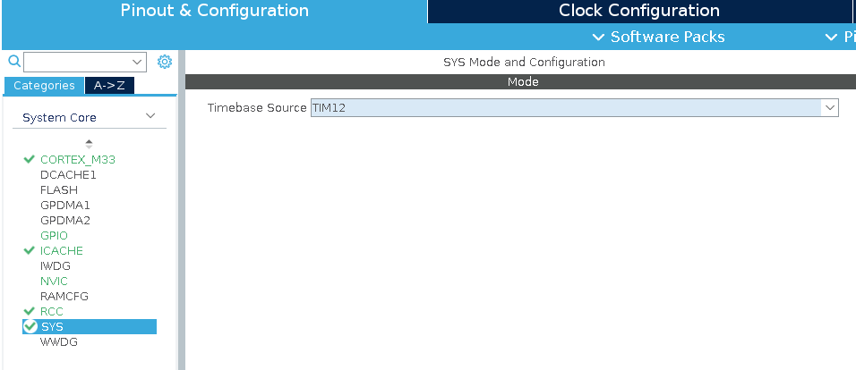

# Zenoh-Pico & LWIP with STM32H5 Step By Step Tutorial

## List of Contents

- [Zenoh-Pico \& LWIP with STM32H5 Step By Step Tutorial](#zenoh-pico--lwip-with-stm32h5-step-by-step-tutorial)
  - [List of Contents](#list-of-contents)
  - [Overview](#overview)
  - [Project Setup](#project-setup)
    - [CubeMX Project Creation](#cubemx-project-creation)
    - [Clock Configuration](#clock-configuration)
    - [Configure the ICACHE](#configure-the-icache)
    - [Configure USART3](#configure-usart3)
    - [Configure the Ethernet](#configure-the-ethernet)
    - [Configuring user button and leds](#configuring-user-button-and-leds)
    - [Final Pinout Configuration](#final-pinout-configuration)
    - [FreeRTOS](#freertos)
  - [Coding](#coding)
    - [Add Connection for UART and printf](#add-connection-for-uart-and-printf)
    - [Change base CMake to Performance (Optional)](#change-base-cmake-to-performance-optional)
    - [Create hex, bin and elf files (Optional)](#create-hex-bin-and-elf-files-optional)
    - [Add needed submodules](#add-needed-submodules)
    - [Basic needed prerequisites configuration on CMakelists.txt](#basic-needed-prerequisites-configuration-on-cmakeliststxt)
    - [Configure the LWIP lib from ST](#configure-the-lwip-lib-from-st)
    - [Configure the LAN8742 from ST](#configure-the-lan8742-from-st)
    - [Add needed base files for LWIP to operate](#add-needed-base-files-for-lwip-to-operate)
    - [Make a simple DHCP IP acquisition](#make-a-simple-dhcp-ip-acquisition)
    - [Configure the Zenoh-Pico lib](#configure-the-zenoh-pico-lib)
    - [Declare a simple pub/sub example](#declare-a-simple-pubsub-example)
  - [How to flash and debug](#how-to-flash-and-debug)

## Overview

This documentation provides a comprehensive, step-by-step tutorial on integrating **Zenoh-Pico** and **LWIP** with the **STM32H563ZI Nucleo board**. It guides you through the entire process, from creating the initial CubeMX project and configuring peripherals, to modifying the `CMakeLists.txt` file, integrating the required libraries, implementing a basic publish/subscribe example, and utilizing **GitHub Actions** to automate firmware builds and releases.

This tutorial assumes prior familiarity with **STM32CubeMX**, **CMake**, and **GitHub Actions**. Although the instructions target the **NUCLEO-H563ZI**, they can be adapted for other STM32 boards. If you are using a different board, please refer to its datasheet and adjust configurations such as pin assignments and clock settings accordingly.

## Project Setup

### CubeMX Project Creation

Open **STM32CubeMX**, navigate to the top menu bar, and select **File → New Project**.


When prompted about TrustZone, select the option **"Without TrustZone activated"**.

Next, navigate to **Project Manager**, click the **Browse** button to choose the project location, and specify a project name. Ensure the **Toolchain / IDE** is set to **CMake**.


As an optional but recommended step for better code organization, go to **Project Manager → Code Generator** and enable **"Generate peripheral initialization as a pair of '.c/.h' files per peripheral"**. This setting modularizes the generated code by separating each peripheral's initialization into distinct source and header files.

Additionally, enable **"Copy only the necessary library files"** to prevent unnecessary files from being included in the project.


### Clock Configuration

This step is specific to the **NUCLEO-H563ZI** board. If you are using a different board, refer to its datasheet to adjust the clock configuration accordingly.

Navigate to **Pinout & Configuration → System Core → RCC**, and apply the following settings:

1. Set **HSE** to **BYPASS Clock Source**
2. Set **LSE** to **Crystal/Ceramic Resonator**


After completing the previous step, navigate to the **Clock Configuration** tab and apply the following settings:

1. Set the **Input Frequency (HSE)** to **8 MHz** by clicking the corresponding field and entering the value.
2. Set the **PLL1 Source** to **HSE**.
3. Set the **System Clock Mux** to **PLLCLK**.


After applying these settings, you may encounter errors in the clock configuration section. To resolve them, set the **HCLK (MHz)** to **250 MHz** and press **Enter**. A message will appear indicating that the configuration is being updated. After a few moments, the errors should be cleared, and the clock configuration will be correctly applied.


### Configure the ICACHE

Navigate to **Pinout & Configuration → System Core → ICACHE**, and set **ICACHE** to **1-way direct mapped**.


### Configure USART3

On the **NUCLEO-H563ZI** board, **USART3** is connected to the **ST-Link** and can be used for printing debug messages. Navigate to **Pinout & Configuration → Connectivity → USART3**, enable **USART3**, and set it to **Asynchronous Mode**. Use the default configuration settings.


Next, configure the **USART3** pinout as follows:

- Set **RX** to **PD9**
- Set **TX** to **PD8**


### Configure the Ethernet

On the **NUCLEO-H563ZI** board, the Ethernet interface is connected via **RMII**, and must be configured accordingly. Navigate to **Pinout & Configuration → Connectivity → ETH**, enable **ETH**, and set the **Mode** to **RMII**.

For initial setup, apply the following settings:

- Set **TX Descriptor Length** to **12**
- Set **RX Descriptor Length** to **8**
- Leave the **MAC Address** as default or modify it if needed

Further adjustments can be made once the base project is functional.


Ensure that the **Ethernet Global Interrupt** is enabled in the **NVIC Settings**.


Next, configure the code generator to avoid automatically calling the **MX_ETH_Init** function, as it will be invoked within the LWIP `ethernetif.c` file.
Navigate to **Project Manager → Advanced Settings**, and under **Do Not Generate Function Call**, select **MX_ETH_Init**.


On the **Pinout** view, ensure the following Ethernet-related pin assignments are configured:

- **ETH_TXD0** → **PG13**
- **ETH_TX_EN** → **PG11**
- **ETH_MDC** → **PC1**
- **ETH_REF_CLK** → **PA1**
- **ETH_MDIO** → **PA2**
- **ETH_CRS_DV** → **PA7**
- **ETH_RXD0** → **PC4**
- **ETH_RXD1** → **PC5**
- **ETH_TXD1** → **PB15**

Refer to the final pinout diagram after the next section for visual confirmation.

### Configuring user button and leds

For the **User Button** and **LEDs**, apply the following pin configurations and labels:

- **PC13** → **GPIO_EXTI13**, label as **USER_BUTTON**
- **PF4** → **GPIO_Output**, label as **LED_YELLOW**
- **PB0** → **GPIO_Output**, label as **LED_GREEN**
- **PG4** → **GPIO_Output**, label as **LED_RED**

### Final Pinout Configuration

After completing all the above steps, your **pinout configuration** should appear as shown in the reference image below.


### FreeRTOS

Although **LWIP** can operate using a bare main loop, the use of **Zenoh-Pico** requires an **RTOS**.

Navigate to **Pinout & Configuration → Middleware and Software Packs → X-CUBE-FREERTOS**, and click on it. If this is your first time accessing it, you may be prompted to download the package—proceed with the download.

Once available, select the package and apply the required configurations. Click **OK** to confirm.


After enabling **FreeRTOS**, immediately click **Generate Code** to avoid potential corruption of the `.ioc` file due to a known bug in certain versions of STM32CubeMX on specific platforms.

> **Note:** In some cases, enabling FreeRTOS may cause STM32CubeMX to crash. If this occurs, close CubeMX and open the project in **STM32CubeIDE**. Navigate to **Pinout & Configuration → Middleware and Software Packs → X-CUBE-FREERTOS** and enable FreeRTOS there. Once configured, you can close STM32CubeIDE and return to CubeMX.
> Ensure you revisit **Project Manager** and reset the **Toolchain / IDE** to **CMake**, as STM32CubeIDE may change it automatically. You may also delete the `.project` file generated by STM32CubeIDE.

Next, configure a dedicated system timer for FreeRTOS. Navigate to **Pinout & Configuration → System Core → SYS** and set the **Timebase Source** to **TIM12**.



The next step is a recommendation and may vary based on your firmware requirements. However, it is advisable to increase the **minimal stack size** and **heap size**, as the default values are typically very small.

It is recommended to set:

- **Minimal Stack Size** to **2 KB**
- **Heap Size** to **40 KB**


Next, navigate to **System Core → NVIC** and set the **ETH Global Interrupt** to a **preemption priority of 7**.


Finally, click **Generate Code** to apply all configurations and generate the project files.

## Coding

Now begin the coding phase of the project. The following steps will prepare the project for integrating **Zenoh-Pico** and **LWIP**.

### Add Connection for UART and printf

To enable debugging and logging, set up the UART connection to support the `printf` function. If you selected the option to generate peripheral initialization as a pair of `.c/.h` files per peripheral, use the respective file. Otherwise, you may place the code in `main.c`.

Add the following implementation to the `/* USER CODE BEGIN 1 */` section of the `firmware/Core/Src/usart.c` file:

```c
int _write(int fd, char *ptr, int len)
{
  /** In case of printf we keep synchonous since some parts use DMA */
  if (fd == 1 || fd == 2) {
    HAL_StatusTypeDef tx_status = HAL_UART_Transmit(&huart3, (uint8_t *)ptr, len, HAL_MAX_DELAY);

    if (tx_status == HAL_OK) {
      return len;
    }
  }

  return -1;
}
```

This enables the use of the `printf` function for printing debug messages over UART.

To verify functionality, add a simple test in the `firmware/Core/Src/app_freertos.c` file by inserting the following code into the respective sections:

```c
/* USER CODE BEGIN Includes */
#include <stdio.h>
/* USER CODE END Includes */
```

```c
/* USER CODE BEGIN defaultTask */
/* Infinite loop */
for(;;)
{
  printf("Hello World!\n");
  osDelay(1000);
}
/* USER CODE END defaultTask */
```

After completing these steps, proceed to the [How to Flash and Debug](#how-to-flash-and-debug) section. Flash the firmware to the board and open a serial monitor to verify that the message **"Hello World!"** is being printed.

### Change base CMake to Performance (Optional)

This step is optional and should be considered based on the specific needs of your application.

By default, **STM32CubeMX** generates the base CMake configuration using the flags `-O0 -g3`, which disables optimizations. This setting is generally suitable for microcontrollers, as aggressive optimizations can result in code being removed if not explicitly marked (e.g., `volatile`), potentially leading to unexpected behavior. However, it may also result in slower execution.

If your application requires **maximum performance** and **code size is not a concern**, it is recommended to change the optimization level to `-Ofast`. Be aware that this can introduce subtle bugs due to compiler optimizations, especially in sections of code that depend on side effects or precise timing.

Use the following guidelines to decide:

- **Do you need the maximum performance possible?**
  - **Yes:** Use `-Ofast`
  - **No:** Keep the default settings

- **Do you need to minimize resource usage or power consumption?**
  - **Yes:** Keep the default settings
  - **No:** Use `-Ofast`

To enhance performance through optimization, open the `firmware/cmake/gcc-arm-none-eabi.cmake` file and apply the following modifications:

Remove the following lines:
```diff
- set(CMAKE_C_FLAGS "${CMAKE_C_FLAGS} ${TARGET_FLAGS}")
- set(CMAKE_C_FLAGS "${CMAKE_C_FLAGS} -Wall -Wextra -Wpedantic -fdata-sections -ffunction-sections")
- if(CMAKE_BUILD_TYPE MATCHES Debug)
-     set(CMAKE_C_FLAGS "${CMAKE_C_FLAGS} -O0 -g3")
- endif()
- if(CMAKE_BUILD_TYPE MATCHES Release)
-     set(CMAKE_C_FLAGS "${CMAKE_C_FLAGS} -Os -g0")
- endif()
-
- set(CMAKE_ASM_FLAGS "${CMAKE_C_FLAGS} -x assembler-with-cpp -MMD -MP")
- set(CMAKE_CXX_FLAGS "${CMAKE_C_FLAGS} -fno-rtti -fno-exceptions -fno-threadsafe-statics")
```

And add the following lines:

```diff
+ set(COMMON_FLAGS "${COMMON_FLAGS} ${TARGET_FLAGS}")
+ set(COMMON_FLAGS "${COMMON_FLAGS}  -Wall -Wextra -Wpedantic -fdata-sections -ffunction-sections")
+ if(CMAKE_BUILD_TYPE MATCHES Debug)
+     set(COMMON_FLAGS "${COMMON_FLAGS} -Ofast -g3")
+ endif()
+ if(CMAKE_BUILD_TYPE MATCHES Release)
+     set(COMMON_FLAGS "${COMMON_FLAGS} -Ofast -g0")
+ endif()
+
+ set(CMAKE_C_FLAGS "${COMMON_FLAGS} -std=gnu11")
+ set(CMAKE_ASM_FLAGS "${CMAKE_C_FLAGS} -x assembler-with-cpp -MMD -MP")
+ set(CMAKE_CXX_FLAGS "${CMAKE_C_FLAGS} -std=gnu++17 -fno-rtti -fno-exceptions -fno-threadsafe-statics")
```

### Create hex, bin and elf files (Optional)

To generate the HEX, BIN, and ELF files, append the following lines to the end of the `firmware/CMakeLists.txt` file:

```cmake
# Create binary and hex files
add_custom_command(
    TARGET ${CMAKE_PROJECT_NAME}
    POST_BUILD
    COMMAND ${CMAKE_OBJCOPY} -O binary $<TARGET_FILE:${CMAKE_PROJECT_NAME}> ${CMAKE_PROJECT_NAME}.bin
    COMMAND ${CMAKE_OBJCOPY} -O ihex $<TARGET_FILE:${CMAKE_PROJECT_NAME}> ${CMAKE_PROJECT_NAME}.hex
    WORKING_DIRECTORY ${CMAKE_BINARY_DIR}
    COMMENT "Creating binary and hex file"
)
```

### Add needed submodules

This project requires **LWIP**, **LAN8742**, and **Zenoh-Pico**, which will be added as submodules. To include these dependencies, follow the steps below:

1. Create a directory named `Lib` inside the `firmware` folder.
2. Open a terminal and navigate to the `firmware/Lib` directory.
3. Execute the following commands:

> **Note:** Until the pull request is merged in the official Zenoh-Pico repository, be sure to use the appropriate custom branch.

```bash
git submodule add git@github.com:STMicroelectronics/stm32-mw-lwip.git
git submodule add git@github.com:STMicroelectronics/stm32-lan8742.git
git submodule add git@github.com:eclipse-zenoh/zenoh-pico.git
```

After completing these steps, your project structure should resemble the following:

```
firmware
├── Lib
│   ├── stm32-lan8742
│   ├── stm32-mw-lwip
│   └── zenoh-pico
```

### Basic needed prerequisites configuration on CMakelists.txt

Before configuring each submodule, it is necessary to add some basic settings to the `firmware/CMakeLists.txt` file. These include the creation of required targets for Zenoh-Pico, the definition of a variable listing the modules to be imported by other submodules, and optionally, the enabling of C++ support.

To enable C++ support, make the following modifications to the top of the `firmware/CMakeLists.txt` file:

```diff
set(CMAKE_C_STANDARD 11)
set(CMAKE_C_STANDARD_REQUIRED ON)
set(CMAKE_C_EXTENSIONS ON)

+ set(CMAKE_CXX_STANDARD 17)
+ set(CMAKE_CXX_STANDARD_REQUIRED ON)
```

```diff
- # Enable CMake support for ASM and C languages
- enable_language(C ASM)
+ # Enable CMake support for ASM and C languages (C++ also but can be disabled)
+ enable_language(C ASM CXX)
```

After including the `cmake/stm32cubemx` subdirectory, it is necessary to extract its include directories for use in other libraries, create a `freertos_config` library target for use by submodules, and alias the `stm32cubemx` target to `freertos_kernel`. These steps are essential for proper integration and should all be applied to the `firmware/CMakeLists.txt` file.

We begin by creating the `freertos_config` target, which will be passed to other submodules:

```diff
# Add STM32CubeMX generated sources
add_subdirectory(cmake/stm32cubemx)

+ add_library(freertos_config INTERFACE)
+ target_include_directories(freertos_config SYSTEM INTERFACE
+   "${CMAKE_CURRENT_SOURCE_DIR}/Core/Inc"
+ )
+ target_compile_options(freertos_config INTERFACE -Wno-error)
```

After that we need to alias the `stm32cubemx` target to be the `freertos_kernel`, followin previous diff add this:

```diff
+ # CubeMX is the one providing the FreeRTOS kernel
+ add_library(freertos_kernel ALIAS stm32cubemx)
```

Finally, lets define a variable containing the include directories from the `stm32cubemx` target. This will allow us to forward the necessary paths to other submodules for proper integration:

```diff
+ # Get include directories provided by STM32CubeMX
+ get_target_property(CUBE_MX_PROVIDED_INCLUDE_DIRS stm32cubemx INTERFACE_INCLUDE_DIRECTORIES)
```

### Configure the LWIP lib from ST

Following the changes from the previous step, just after the `get_target_property(CUBE_MX_PROVIDED_INCLUDE_DIRS stm32cubemx INTERFACE_INCLUDE_DIRECTORIES)` line, add the following lines:

```cmake
set(LWIP_SPECIFIC_INCLUDE_DIRS
    "${CMAKE_CURRENT_SOURCE_DIR}/Lib/stm32-mw-lwip/src/include"
    "${CMAKE_CURRENT_SOURCE_DIR}/Lib/stm32-mw-lwip/system"
    "${CMAKE_CURRENT_SOURCE_DIR}/Core/Inc/LWIP/Target"
)

set(LWIP_INCLUDE_DIRS
    ${LWIP_SPECIFIC_INCLUDE_DIRS}
    ${CUBE_MX_PROVIDED_INCLUDE_DIRS}
)

add_library(lwip-system INTERFACE)

target_include_directories(lwip-system INTERFACE
  ${LWIP_SPECIFIC_INCLUDE_DIRS}
  ${CUBE_MX_PROVIDED_INCLUDE_DIRS}
)

target_sources(lwip-system  INTERFACE
    "${CMAKE_CURRENT_SOURCE_DIR}/Lib/stm32-mw-lwip/system/OS/sys_arch.c"
)

add_subdirectory(Lib/stm32-mw-lwip)
```

This step adds the **LWIP** library, specifies the required include directories, and compiles the `OS` component that provides the fundamental functionality required for LWIP to operate. Note that a specific path—`"${CMAKE_CURRENT_SOURCE_DIR}/Core/Inc/LWIP/Target"`—is included, but this directory does not yet exist. In the following steps, we will create this directory and add the necessary LWIP configuration file to it.

### Configure the LAN8742 from ST

Following the changes from the previous step, just after the `add_subdirectory(Lib/stm32-mw-lwip)` line, add the following lines:

```cmake
add_library(lan8742 INTERFACE)

set(LAN8742_SPECIFIC_INCLUDE_DIRS
    "${CMAKE_CURRENT_SOURCE_DIR}/Lib/stm32-lan8742"
)

target_include_directories(lan8742 INTERFACE
    ${LAN8742_SPECIFIC_INCLUDE_DIRS}
    ${CUBE_MX_PROVIDED_INCLUDE_DIRS}
)

target_sources(lan8742 INTERFACE
    "${CMAKE_CURRENT_SOURCE_DIR}/Lib/stm32-lan8742/lan8742.c"
)
```

### Add needed base files for LWIP to operate

If all the previous steps have been followed correctly, you should now be able to add the necessary Ethernet interface files to the project and begin developing a basic application that utilizes the LWIP stack. To proceed, the following project structure must be added:

```
firmware
├── Core
│   ├── Inc
|   |   ├── LWIP
|   |   |   ├── App
|   |   |   |   ├── ethernet.h
|   |   |   ├── Target
|   |   |   |   ├── ethernetif.h
|   |   |   |   ├── lwipopts.h
|   |   |   ...
│   ├── Src
|   |   |── LWIP
|   |   |   ├── App
|   |   |   |   ├── ethernet.c
|   |   |   ├── Target
|   |   |   |   ├── ethernetif.c
|   |   |   ...
```

Each file in the structure serves a specific role within the Ethernet integration:

- **`ethernet.h` and `ethernet.c`**: These files form the main application layer responsible for initializing and starting the LWIP stack. They handle the interface configuration, including setting a static IP or acquiring one via DHCP. You may modify these files to include any additional setup required by other modules. Think of this as the network stack's startup logic.

- **`ethernetif.h` and `ethernetif.c`**: These files implement the hardware interface for LWIP. They manage the low-level transmission and reception of network packets. These are typically based on the default ST-provided implementations, with minor modifications to integrate with the code generated by STM32CubeMX.

- **`lwipopts.h`**: This is the LWIP configuration file, which defines stack parameters such as buffer counts and sizes, maximum number of connections, and other behavior customizations to tailor the stack to your application needs.

Before proceeding, ensure all required folders and files are created. Once the structure is in place, continue with the following steps to configure them properly.

Most part of the files will be based on the provided from [st classic-coremw-apps](https://github.com/STMicroelectronics/stm32h5-classic-coremw-apps) repository, for the H5 series. For our example we gonna use the [LwIP_HTTP_Server_Socket_RTOS](https://github.com/STMicroelectronics/stm32h5-classic-coremw-apps/tree/main/Projects/NUCLEO-H563ZI/Applications/LwIP/LwIP_HTTP_Server_Socket_RTOS) as a base. Some concepts were also used from the tutorial post on ST comunity [How to use the LwIP Ethernet middleware on the STM32H5 series](https://community.st.com/t5/stm32-mcus/how-to-use-the-lwip-ethernet-middleware-on-the-stm32h5-series/ta-p/691100). Thanks to the authors for the great content.

If you just want the final file you can directly copy the [ethernetif.c](https://github.com/joaomariolago/stm32h5-zenoh-lwip-demo/tree/master/firmware/Core/Src/LWIP/Target/ethernetif.c) from my repository and skip to the next step configuring the `ethernetif.h` file.

Otherwise if you want to configure step by step from original source copy the contents from ST [ethernetif.c](https://github.com/STMicroelectronics/stm32h5-classic-coremw-apps/blob/main/Projects/NUCLEO-H563ZI/Applications/LwIP/LwIP_HTTP_Server_Socket_RTOS/LWIP/Target/ethernetif.c) to our `firmware/Core/Src/LWIP/Target/ethernetif.c` file.

First lets modify the includes to take in account our project structure, so change the following includes:

```diff
/* Includes ------------------------------------------------------------------*/
-#include "stm32h5xx_hal.h"
-#include "FreeRTOS.h"
-#include "semphr.h"
-#include "lwip/timeouts.h"
-#include "netif/ethernet.h"
-#include "netif/etharp.h"
-#include "lwip/stats.h"
-#include "lwip/snmp.h"
-#include "lwip/tcpip.h"
-#include "ethernetif.h"
-#include "../Components/lan8742/lan8742.h"
-#include <string.h>
-#include "lwip/netifapi.h"
```
```diff
/* Includes ------------------------------------------------------------------*/
+ #include <string.h>
+ #include "stm32h5xx_hal.h"
+ #include "FreeRTOS.h"
+ #include "semphr.h"
+ #include "eth.h"
+ #include "lan8742.h"
+ #include "lwip/timeouts.h"
+ #include "lwip/tcpip.h"
+ #include "lwip/netifapi.h"
+ #include "lwip/stats.h"
+ #include "lwip/snmp.h"
+ #include "netif/ethernet.h"
+ #include "netif/etharp.h"
+ #include "LWIP/Target/ethernetif.h"
```

Secondly, we need to change some variables to `extern` since they will be defined in our `eth.c` file. Change the following variables:

```diff
- ETH_DMADescTypeDef  DMARxDscrTab[ETH_RX_DESC_CNT]; /* Ethernet Rx DMA Descriptors */
- ETH_DMADescTypeDef  DMATxDscrTab[ETH_TX_DESC_CNT]; /* Ethernet Tx DMA Descriptors */
+ extern ETH_DMADescTypeDef  DMARxDscrTab[ETH_RX_DESC_CNT]; /* Ethernet Rx DMA Descriptors */
+ extern ETH_DMADescTypeDef  DMATxDscrTab[ETH_TX_DESC_CNT]; /* Ethernet Tx DMA Descriptors */
```

```
/* Global Ethernet handle */
ETH_HandleTypeDef EthHandle;
- ETH_TxPacketConfig TxConfig;
+ extern ETH_TxPacketConfigTypeDef TxConfig;
```

After this, we can remove the following line and use find and replace to change all exact matches of `EthHandle` to `heth`:

```diff
/* Global Ethernet handle */
- ETH_HandleTypeDef EthHandle;
```

Make sure to use exact match, indentation, and match whole word to avoid modifying other variables with the same name.

Next, we need to modify the `low_level_init` function to utilize the code generated by CubeMX. Change the following lines:

```diff
static void low_level_init(struct netif *netif)
{
  uint32_t duplex, speed = 0U;
  int32_t PHYLinkState = 0U;
  ETH_MACConfigTypeDef MACConf = {0};
- uint8_t macaddress[6]= {ETH_MAC_ADDR0, ETH_MAC_ADDR1, ETH_MAC_ADDR2, ETH_MAC_ADDR3, ETH_MAC_ADDR4, ETH_MAC_ADDR5};

- heth.Instance = ETH;
- heth.Init.MACAddr = macaddress;
- heth.Init.MediaInterface = HAL_ETH_RMII_MODE;
- heth.Init.RxDesc = DMARxDscrTab;
- heth.Init.TxDesc = DMATxDscrTab;
- heth.Init.RxBuffLen = ETH_RX_BUFFER_SIZE;

- /* configure ethernet peripheral (GPIOs, clocks, MAC, DMA) */
- HAL_ETH_Init(&heth);

+ MX_ETH_Init();

  /* set MAC hardware address length */
  netif->hwaddr_len = ETH_HWADDR_LEN;

  /* set MAC hardware address */
- netif->hwaddr[0] =  ETH_MAC_ADDR0;
- netif->hwaddr[1] =  ETH_MAC_ADDR1;
- netif->hwaddr[2] =  ETH_MAC_ADDR2;
- netif->hwaddr[3] =  ETH_MAC_ADDR3;
- netif->hwaddr[4] =  ETH_MAC_ADDR4;
- netif->hwaddr[5] =  ETH_MAC_ADDR5;
+ netif->hwaddr[0] =  heth.Init.MACAddr[0];
+ netif->hwaddr[1] =  heth.Init.MACAddr[1];
+ netif->hwaddr[2] =  heth.Init.MACAddr[2];
+ netif->hwaddr[3] =  heth.Init.MACAddr[3];
+ netif->hwaddr[4] =  heth.Init.MACAddr[4];
+ netif->hwaddr[5] =  heth.Init.MACAddr[5];

  /* maximum transfer unit */
  netif->mtu = ETH_MAX_PAYLOAD;

  /* device capabilities */
  /* don't set NETIF_FLAG_ETHARP if this device is not an ethernet one */
  netif->flags |= NETIF_FLAG_BROADCAST | NETIF_FLAG_ETHARP;

  /* Initialize the RX POOL */
  LWIP_MEMPOOL_INIT(RX_POOL);

- /* Set Tx packet config common parameters */
- memset(&TxConfig, 0 , sizeof(ETH_TxPacketConfig));
- TxConfig.Attributes = ETH_TX_PACKETS_FEATURES_CSUM | ETH_TX_PACKETS_FEATURES_CRCPAD;
- TxConfig.ChecksumCtrl = ETH_CHECKSUM_IPHDR_PAYLOAD_INSERT_PHDR_CALC;
- TxConfig.CRCPadCtrl = ETH_CRC_PAD_INSERT;

  /* create a binary semaphore used for informing ethernetif of frame reception */
```

Finally, we need to remove the Ethernet MSP code since it is generated by CubeMX. Remove the following content:

```diff
- /*******************************************************************************
-                        Ethernet MSP Routines
- *******************************************************************************/
- /**
-   * @brief  Initializes the ETH MSP.
-   * @param  heth: ETH handle
-   * @retval None
-   */
- void HAL_ETH_MspInit(ETH_HandleTypeDef *heth)
- {
-  GPIO_InitTypeDef GPIO_InitStruct = {0};
-  if(heth->Instance==ETH)
-  {
-    /* USER CODE BEGIN ETH_MspInit 0 */
-
-    /* USER CODE END ETH_MspInit 0 */
-    /* Peripheral clock enable */
-    __HAL_RCC_ETH_CLK_ENABLE();
-    __HAL_RCC_ETHTX_CLK_ENABLE();
-    __HAL_RCC_ETHRX_CLK_ENABLE();
-
-    __HAL_RCC_GPIOC_CLK_ENABLE();
-    __HAL_RCC_GPIOA_CLK_ENABLE();
-    __HAL_RCC_GPIOB_CLK_ENABLE();
-    __HAL_RCC_GPIOG_CLK_ENABLE();
-    /**ETH GPIO Configuration
-    PC1     ------> ETH_MDC
-    PA1     ------> ETH_REF_CLK
-    PA2     ------> ETH_MDIO
-    PA7     ------> ETH_CRS_DV
-    PC4     ------> ETH_RXD0
-    PC5     ------> ETH_RXD1
-    PB15     ------> ETH_TXD1
-    PG11     ------> ETH_TX_EN
-    PG13     ------> ETH_TXD0
-    */
-    GPIO_InitStruct.Pin = GPIO_PIN_1|GPIO_PIN_4|GPIO_PIN_5;
-    GPIO_InitStruct.Mode = GPIO_MODE_AF_PP;
-    GPIO_InitStruct.Pull = GPIO_NOPULL;
-    GPIO_InitStruct.Speed = GPIO_SPEED_FREQ_LOW;
-    GPIO_InitStruct.Alternate = GPIO_AF11_ETH;
-    HAL_GPIO_Init(GPIOC, &GPIO_InitStruct);
-
-    GPIO_InitStruct.Pin = GPIO_PIN_1|GPIO_PIN_2|GPIO_PIN_7;
-    GPIO_InitStruct.Mode = GPIO_MODE_AF_PP;
-    GPIO_InitStruct.Pull = GPIO_NOPULL;
-    GPIO_InitStruct.Speed = GPIO_SPEED_FREQ_LOW;
-    GPIO_InitStruct.Alternate = GPIO_AF11_ETH;
-    HAL_GPIO_Init(GPIOA, &GPIO_InitStruct);
-
-    GPIO_InitStruct.Pin = GPIO_PIN_15;
-    GPIO_InitStruct.Mode = GPIO_MODE_AF_PP;
-    GPIO_InitStruct.Pull = GPIO_NOPULL;
-    GPIO_InitStruct.Speed = GPIO_SPEED_FREQ_LOW;
-    GPIO_InitStruct.Alternate = GPIO_AF11_ETH;
-    HAL_GPIO_Init(GPIOB, &GPIO_InitStruct);
-
-    GPIO_InitStruct.Pin = GPIO_PIN_11|GPIO_PIN_13;
-    GPIO_InitStruct.Mode = GPIO_MODE_AF_PP;
-    GPIO_InitStruct.Pull = GPIO_NOPULL;
-    GPIO_InitStruct.Speed = GPIO_SPEED_FREQ_LOW;
-    GPIO_InitStruct.Alternate = GPIO_AF11_ETH;
-    HAL_GPIO_Init(GPIOG, &GPIO_InitStruct);
-
-    /* ETH interrupt Init */
-    HAL_NVIC_SetPriority(ETH_IRQn, 7, 0);
-    HAL_NVIC_EnableIRQ(ETH_IRQn);
-    /* USER CODE BEGIN ETH_MspInit 1 */
-
-    /* USER CODE END ETH_MspInit 1 */
-   }
- }
```

With that, the `ethernetif.c` file should be ready to use. Next, we will create the `ethernetif.h` file. In the `firmware/Core/Inc/LWIP/Target/ethernetif.h` file, add the following content:

```c
#ifndef _LWIP_APP_ETHERNET_IF_H_
#define _LWIP_APP_ETHERNET_IF_H_

#include "lwip/err.h"
#include "lwip/netif.h"
#include "cmsis_os2.h"

err_t ethernetif_init(struct netif *netif);
void ethernet_link_thread(void *argument);

#endif /* _LWIP_APP_ETHERNET_IF_H_ */
```

Next, we will create the LWIP configuration file. To do this, copy the contents from the ST-provided [lwipopts.h](https://github.com/joaomariolago/stm32h5-zenoh-lwip-demo/tree/master/firmware/Core/Inc/LWIP/Target/lwipopts.h) into our `firmware/Core/Inc/LWIP/Target/lwipopts.h` file.

With this, the LWIP stack should be ready to use. The next step is to create the basic application that will initialize the LWIP stack and configure the interface.

Now, we will implement the base application responsible for starting the LWIP stack and configuring the interface. It should be capable of obtaining a dynamic IP address when the link is up and allow our main task to use the network stack.

For this copy the [ethernet.h](https://github.com/joaomariolago/stm32h5-zenoh-lwip-demo/tree/master/firmware/Core/Inc/LWIP/App/ethernet.h) to `firmware/Core/Inc/LWIP/App/ethernet.h` and [ethernet.c](https://github.com/joaomariolago/stm32h5-zenoh-lwip-demo/tree/master/firmware/Core/Src/LWIP/App/ethernet.c) to `firmware/Core/Src/LWIP/App/ethernet.c`.

These files will contain the base of our application and will be responsible for starting the LWIP stack and configuring the interface. You can modify default/fallback IP as well as other parameters on the `ethernet.h` file.

Make sure to add the remaining includes and created files on the CMakeLists.txt file, so add the following lines:

```diff
# Add sources to executable
target_sources(${CMAKE_PROJECT_NAME} PRIVATE
    # Add user sources here
+    "${CMAKE_CURRENT_SOURCE_DIR}/Core/Src/LWIP/App/ethernet.c"
+    "${CMAKE_CURRENT_SOURCE_DIR}/Core/Src/LWIP/Target/ethernetif.c"
)

# Add include paths
target_include_directories(${CMAKE_PROJECT_NAME} PRIVATE
    # Add user defined include paths
+    ${LWIP_SPECIFIC_INCLUDE_DIRS}
+    ${LAN8742_SPECIFIC_INCLUDE_DIRS}
)

# Add project symbols (macros)
target_compile_definitions(${CMAKE_PROJECT_NAME} PRIVATE
    # Add user defined symbols
)

# Add linked libraries
target_link_libraries(${CMAKE_PROJECT_NAME}
    stm32cubemx

    # Add user defined libraries
+    lan8742
+    lwip-system
+    lwipcore
)
```

### Make a simple DHCP IP acquisition

After completing the previous steps, the LWIP stack should be ready to use. We can now create a simple application to start the stack and configure the interface to acquire a dynamic IP address. To do this, copy [ethernet.h](https://github.com/joaomariolago/stm32h5-zenoh-lwip-demo/tree/master/firmware/Core/Inc/LWIP/App/ethernet.h) to `firmware/Core/Inc/LWIP/App/ethernet.h` and [ethernet.c](https://github.com/joaomariolago/stm32h5-zenoh-lwip-demo/tree/master/firmware/Core/Src/LWIP/App/ethernet.c) to `firmware/Core/Src/LWIP/App/ethernet.c`.

Then, add the following code to the `firmware/Core/Src/app_freertos.c` file:

```diff
/* Private includes ----------------------------------------------------------*/
/* USER CODE BEGIN Includes */
+ #include <stdio.h>

+ #include "lwip/tcpip.h"
+ #include "LWIP/App/ethernet.h"
/* USER CODE END Includes */
```

```diff
/* Private variables ---------------------------------------------------------*/
/* USER CODE BEGIN Variables */

+ osThreadId_t h_app_task;
+ const osThreadAttr_t app_task_attributes = {
+   .name = "app_task",
+   .priority = (osPriority_t) osPriorityNormal,
+   .stack_size = configMINIMAL_STACK_SIZE
+ };

/* USER CODE END Variables */
```

```diff
/* USER CODE BEGIN FunctionPrototypes */

+ void app_task(void */**argument */);

/* USER CODE END FunctionPrototypes */
```

```diff
/* USER CODE END Header_StartDefaultTask */
void StartDefaultTask(void *argument)
{
  /* USER CODE BEGIN defaultTask */

+  /** We start with no LED on */
+  HAL_GPIO_WritePin(LED_GREEN_GPIO_Port, LED_GREEN_Pin, GPIO_PIN_RESET);
+  HAL_GPIO_WritePin(LED_YELLOW_GPIO_Port, LED_YELLOW_Pin, GPIO_PIN_RESET);
+  HAL_GPIO_WritePin(LED_RED_GPIO_Port, LED_RED_Pin, GPIO_PIN_RESET);

+  /* Initialize the LwIP stack */
+  tcpip_init(NULL, NULL);

+  /** Configures the interface and provides event to notify when ready */
+  net_if_config();

+  h_app_task = osThreadNew(app_task, NULL, &app_task_attributes);

+  /* Delete the Init Thread */
+  osThreadTerminate(defaultTaskHandle);

  /* USER CODE END defaultTask */
}

/* Private application code --------------------------------------------------*/
/* USER CODE BEGIN Application */
+void app_task(void */**argument */)
+{
+  printf("App Task, waiting for net\n");
+
+  /** We want to have net ready before starting this task */
+  osEventFlagsWait(h_net_ready_event, 0x01, osFlagsWaitAny, osWaitForever);
+  /** Green LED for user, net is red! */
+  HAL_GPIO_WritePin(LED_GREEN_GPIO_Port, LED_GREEN_Pin, GPIO_PIN_SET);
+
+  printf("Net Ready\n");
+
+  for (;;)
+  {
+    printf("App Task\n");
+    osDelay(1000);
+  }
+}
/* USER CODE END Application */
```

After these additions, we should have a simple application that starts the LWIP stack and configures the interface to acquire a dynamic IP address. The LEDs will indicate the network status with the following pattern: RED on means the link is down, RED off means the link is up but the interface is not ready, YELLOW blinking indicates the DHCP process is running, and GREEN on means the interface is ready to use.

### Configure the Zenoh-Pico lib

Continuing on the modification on the `firmware/CMakeLists.txt` file, make the following changes:

```diff
target_sources(lan8742 INTERFACE
    "${CMAKE_CURRENT_SOURCE_DIR}/Lib/stm32-lan8742/lan8742.c"
)

+ #   - Building for FreeRTOS and LWIP
+ set(WITH_FREERTOS_PLUS_LWIP "ON" CACHE BOOL "" FORCE)

+ #   - We want the static library
+ set(PACKAGING "OFF" CACHE BOOL "" FORCE)
+ set(BUILD_SHARED_LIBS "OFF" CACHE BOOL "" FORCE)

+ #   - No threads
+ set(CHECK_THREADS 0 FORCE)
+ set(THREADS_PREFER_PTHREAD_FLAG "OFF" CACHE BOOL "" FORCE)

+ #   - No tests
+ set(BUILD_TESTING OFF CACHE BOOL "" FORCE)
+ set(BUILD_EXAMPLES OFF CACHE BOOL "" FORCE)

+ #   - Not supported right now
+ set(Z_FEATURE_LINK_UDP_MULTICAST 0 CACHE BOOL "" FORCE)
+ set(Z_FEATURE_MULTI_THREAD 0 CACHE BOOL "" FORCE)

+ set(ZENOH_PICO_DIR "${CMAKE_CURRENT_SOURCE_DIR}/Lib/zenoh-pico")
+ add_subdirectory("${ZENOH_PICO_DIR}")

+ # Configure the Zenoh Pico project
+ include("${ZENOH_PICO_DIR}/cmake/helpers.cmake")
+ configure_include_project(ZENOHPICO zenohpico zenohpico::lib "../.." zenohpico "https://github.com/eclipse-zenoh/zenoh-pico" "")

+ # Edit the Zenoh Pico CMakeLists.txt to remove any set(CHECK_THREADS ON) line to set(CHECK_THREADS 0)
+ set(ZENOH_PICO_CMAKE "${ZENOH_PICO_DIR}/CMakeLists.txt")
+ file(READ "${ZENOH_PICO_CMAKE}" ZENOH_PICO_CMAKE_CONTENTS)
+ string(REPLACE "set(CHECK_THREADS \"ON\")" "set(CHECK_THREADS 0)" ZENOH_PICO_CMAKE_CONTENTS "${ZENOH_PICO_CMAKE_CONTENTS}")
+ file(WRITE "${ZENOH_PICO_CMAKE}" "${ZENOH_PICO_CMAKE_CONTENTS}")
+ message(STATUS "Patched Zenoh Pico: Disabled CHECK_THREADS in CMakeLists.txt")

+ target_link_libraries(zenohpico_static
+   freertos_kernel
+   freertos_config
+   lwip-system
+   lwipcore
+ )

# Link directories setup
target_link_directories(${CMAKE_PROJECT_NAME} PRIVATE
    # Add user defined library search paths
)
```

The section where the CMake file from Zenoh is modified is due to a known issue in the current CMake configuration, which incorrectly forces the inclusion of pthreads when building the library. Since we are targeting a bare-metal platform, this must be disabled. This issue will likely be resolved in an upcoming pull request.

Additionally, we need to add a compile definition to the base `stm32cubemx` target:

```diff
# Add STM32CubeMX generated sources
add_subdirectory(cmake/stm32cubemx)

+ # Definitions for base project
+ target_compile_definitions(stm32cubemx INTERFACE
+     ZENOH_FREERTOS_PLUS_LWIP
+ )

add_library(freertos_config INTERFACE)
target_include_directories(freertos_config SYSTEM INTERFACE
  "${CMAKE_CURRENT_SOURCE_DIR}/Core/Inc"
)
```

And finally add zenoh to the main project itself:

```diff
# Add include paths
target_include_directories(${CMAKE_PROJECT_NAME} PRIVATE
    # Add user defined include paths

    ${LWIP_SPECIFIC_INCLUDE_DIRS}
    ${LAN8742_SPECIFIC_INCLUDE_DIRS}
+    "${ZENOH_PICO_DIR}/include"
)
```

```diff
# Add linked libraries
target_link_libraries(${CMAKE_PROJECT_NAME}
    stm32cubemx

    # Add user defined libraries
    lan8742
    lwip-system
    lwipcore
+    zenohpico_static
)
```

### Declare a simple pub/sub example

After completing the configuration, we can use any of the examples from the `zenoh-pico` repository.

## How to flash and debug

Coming soon... (STMCubeProgrammer, STM32CubeIDE, OpenOCD, stflash)
